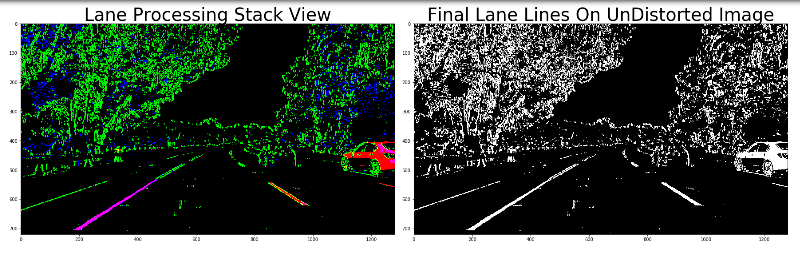

# UDACITY -- Self-Driving Car Engineer [NanoDegree] --
# Part-1--Project-04 - **Advanced Lane Finding**


# PROJECT WRITE-UP

---

## GOALS OF THE PROJECT
The Goals/Steps of this Project are the following:
1. Camera Calibration:  
   Compute the Camera Calibration Matrix and Distortion Co-efficients given a set of ChessBoard Pattern Images.
2. Image Distortion Correction:  
   Apply a Distortion Correction to Raw Images using the computed Camera Calibration Matrix and Distortion Co-efficients.
3. Image Color & Gradient Thresholding:  
   Use Color Transforms, Gradients, etc., to Create a Thresholded Binary Image.
4. Image Perspective Transform:  
   Apply a Perspective Transform to Rectify Binary Images ["Birds-Eye View", so as to Enable Lane Finding].
5. Detect Lane Lines:  
   Detect Lane Line Pixels and Do a Polynomial Fit to Find the Lane Boundary.
6. Determine Lane Curvature & Vehicle Position in Lane:  
   Determine the Curvature of the Lane & Relative Position of Vehicle in the Lane with respect to Lane Center.
7. Warp the Detected Lane Boundaries back Onto the Original Image.
8. Output Visual Display of the Lane Boundaries and Numerical Estimation of Lane Curvature and Vehicle Position.

---

## PROJECT WRITE-UP / README
This Document is the PROJECT WRITE-UP / README.

## Project Rubric Points
In this Project Writeup, I will consider the [**Project Rubric Points**](https://review.udacity.com/#!/rubrics/1966/view) individually and Describe how I addressed Each Point in my Implementation.

## Project Code, Files:
Here are the Links To:
1. [**My Project @ GitHub**](https://github.com/nmuthukumar/UDACITY_SDCarEngg-ND--P1--Prj04-AdvLaneFinding)
2. [**The Project Code @ GitHub** - **IPython NoteBook** containing **'Algorithms based on CV2, Python Libraries, Algebra & Calculus'** For **'Advanced Lane Detection'** under different Hard Conditions on the Road](https://github.com/nmuthukumar/UDACITY_SDCarEngg-ND--P1--Prj04-AdvLaneFinding/blob/master/CarND-Advanced-Lane-Lines/AdvLaneFinding.ipynb)

My **Project** mainly includes the following **Files**:
1. **`AdvLaneFinding.ipynb`** - IPython NoteBook containing **'Algorithms based on OpenCV2, Python Libraries, Algebra & Calculus'** For **'Advanced Lane Detection'** under different Hard Conditions on the Road.
2. Folder **`Test_Images`** containing **Sample Test Images of Road Use-Cases** - To be used for Algo Development & Testing.
3. Folder **`Test_Videos`** containing **Test Videos of Road Use-Cases (of Increasing Hardness!)** - To be used as Input to Apply the **Advanced Lane Detection Algorithm** and Demonstrate the Output.
4. Folder **`Output_Images`** containing **Output Images of Different Stages of the Advanced Lane Detection Algorithm**.
5. Folder **`Output_Videos`** containing Equivalent **Output Videos** of the Test Videos in the Folder `Test_Videos`, showing the **Visualization** of the Successful Working of the **Advanced Lane Finding Algorithm Pipeline's Output**.
6. **`Project_Writeup.md`** - **Project Report** summarizing the Results [THIS FILE! :-)].

---

## 1. Camera Calibration:
- RUBRIC:
  - Criteria:  
    Briefly state How you Computed the Camera Matrix and Distortion Coefficients.  
    Provide an Example of a Distortion Corrected Calibration Image.
  - To Meet Specification:  
    OpenCV Functions or other methods were Used  
    To Calculate the correct Camera Matrix and Distortion Co-efficients  
    Using the Calibration ChessBoard Pattern Images provided in the Repository  
    (Note: These are 9x6 ChessBoard Images, Unlike the 8x6 Images used in the Lessons).  
    The Distortion Matrix should be used to Un-Distort one of the Calibration Images provided  
    as a Demonstration that the Calibration is Correct.  
    Example of Un-Distorted Calibration Image is included in the Write-up (or saved to a Folder).

The **Code** for this Step is contained in the [**IPython NoteBook**](https://github.com/nmuthukumar/UDACITY_SDCarEngg-ND--P1--Prj04-AdvLaneFinding/blob/master/CarND-Advanced-Lane-Lines/AdvLaneFinding.ipynb), `Cells 2 & 3`.

The **Calibration Images - ChessBoard Patterns** used can be seen in the **Folder** [**`Camera_Cal`**](./Camera_Cal/).

The **Idea** here is:
1. Take some Distinct Reference Points (**Object Points**) in the Calibration Images in Real-World.
2. Look For the Same (**Image Points**) in the Camera Images.
3. From the **Distortion** seen in the Camera Images vs. Actual Real-World Points, Calculate the Physical Parameters of the Camera (**Camera Matrix & Distortion Co-efficients**).
4. **Save these Parameters** and Use them later for Correction of All Future Camera Images!

I started by Preparing **"Object Points"**, which will be the Actual (x, y, z) Co-ordinates of the ChessBoard Corners in the Real-World. Here I am assuming that the ChessBoard Patterns are Fixed on the (x, y) Plane at z=0, such that the Object Points are the Same for Each Calibration Image. During the Camera Calibration Process, Every Time when All the ChessBoard Corners are Successfully Detected in a Calibration Image, `object_points`, which is just a Replicated Array of Real-World Co-ordinates, will be appended to the `object_points_detected[]` Array and the Corresponding Detected "**Image Points**" [`corners`], i.e., the (x,y) Pixel Position of Each of the Corners in the Image Plane, will be appended to the `image_points_detected[]` Array.

I used the **CV2 Function** `cv2.findChessboardCorners()` for the Detection of the ChessBoard Corners in the Images. The Result of this Step can be seen using the **CV2 Function** `cv2.drawChessboardCorners()`, as below:


I then used these `object_points_detected[]` and `image_points_detected[]` to Compute the **Camera Calibration Matrix & Distortion Co-efficients** using the **CV2 Function** `cv2.calibrateCamera()`.

In order to **Test** the **Camera Calibration and Distortion Correction**, I then used the Test Image [**`calibration3.jpg`**](./Camera_Cal/calibration3.jpg) and applied Distortion Correction using the **CV2 Function** `cv2.undistort()`. I also went ahead and **UnWarped** the UnDistorted Image by defining the Source Points and Destination Points and using the **CV2 Functions** `cv2.getPerspectiveTransform()` and `cv2.warpPerspective()` and here is the obtained Result!:

#### Output of Camera Calibration [UnDistorted & UnWarped Images]:


## 2. Advanced Lane Finding Algorithm Pipeline (Demonstration using Test Images):
Here, we will see the **Steps** of the **Advanced Lane Finding Algorithm Pipeline** that I developed.  
I take an Example Test Image [**`test5.jpg`**](./Test_Images/test5.jpg) (Shown Below), Run it through the Pipeline, and Demonstrate the Output of Each Stage for this Image.


### 2.1 Image Distortion Correction
- RUBRIC:
  - Criteria:  
    Provide an Example of a Distortion-Corrected Image.
  - To Meet Specification:  
    Distortion Correction that was Calculated Via Camera Calibration has been Correctly Applied To Each Image.  
    An Example of a Distortion Corrected Image should be included in the Write-up (or saved to a Folder)  
    and Submitted with the Project.

The **Code** for this Step is contained in the [**IPython NoteBook**](https://github.com/nmuthukumar/UDACITY_SDCarEngg-ND--P1--Prj04-AdvLaneFinding/blob/master/CarND-Advanced-Lane-Lines/AdvLaneFinding.ipynb), `Cell 4`,  
**Pipeline Function:** `image_undistort()`.

In this Step, I do **UnDistortion**, i.e., Distortion Correction, of Each of the Input Images coming into the Lane Detection Pipeline, using the **Camera Calibration Matrix & Distortion Co-efficients** computed earlier and the **CV2 Function** `cv2.undistort()`, as a Preparation of the Images for Further Processing in the Pipeline.

We can see a Demonstration of the UnDistortion in the following Image. *Note how the Image Straightens-up at the Corners & Edges!*:

#### Output of UnDistortion (Distortion Correction):


### 2.2 Image Color Transforms & Thresholding, Gradients Thresholding [To Enable Clear Identification of Lane Lines]
- RUBRIC:
  - Criteria:  
    Describe How (and Identify Where in your Code) you used Color Transforms, Gradients  
    or other methods to Create a Thresholded Binary Image.  
    Provide an Example of a Binary Image Result.
  - To Meet Specification:  
    A Method or Combination of Methods (i.e., Color Transforms, Gradients)  
    has been Used to Create a Binary Image containing Likely Lane Pixels.  
    There is No "Ground Truth" here, just Visual Verification that  
    the Pixels Identified as part of the Lane Lines are, in fact, part of the Lines!  
    Example Binary Images should be included in the Write-up (or saved to a Folder)  
    and Submitted with the Project.

The **Code** for this Step is contained in the [**IPython NoteBook**](https://github.com/nmuthukumar/UDACITY_SDCarEngg-ND--P1--Prj04-AdvLaneFinding/blob/master/CarND-Advanced-Lane-Lines/AdvLaneFinding.ipynb), `Cell 5`,  
**Pipeline Function:** `pipeline_lanes_color_and_grad_threshold()`.

In order **To Enable the Clear Identification of Lane Markings**, I used a **Combination** of the following **Gradient Thresholds** and **Color Transforms & Thresholds**:
1. Took only the RGB-R (Red) Component of the Image, as it in general represents the Lane Lines Well in Different Conditions, and Took SOBEL Absolute in the x-Direction with Thresholds `sobel_thresh=(min=24, max=120)`.
2. Transformed the Image To HLS Color Space, Separated the S & H Components, as they represent the Lane Lines Well, especially even including the Yellow Lines and even under Shadows, with respective Thresholds `hls_s_thresh=(min=160, max=255)` and `hls_h_thresh=(min=16, max=96))`.
3. Additionally, I directly added the RGB-R (Red) Component of the Image with Thresholds `rgb_r_thresh=(min=224, max=255)` in order to Keep-back the White Color Fillings inside the White Lane Markings, as the White Lane Markings were retained with only just their Boundaries at the End of Step-2 Above.

#### Output of Colors & Gradient Thresholding:
A Stacked View of the Individual Outputs of the Above Steps can be seen in the Left Side of the Output Image below, where:
1. *Red* Pixels show the Output of Step-3 Above, i.e., *Direct RGB-R Thresholding*,
2. *Green* Pixels show the Output of Step-1 Above, i.e., *SOBEL-x Absolute Thresholding*, and
3. *Blue* Pixels show the Output of Step-2 Above, i.e., *HLS-S&H Thresholding*.

Also, the Combined Binary Output Image of All of the Above Steps can be seen in the Right Side of the Image below.



### 2.3 Image Perspective Transformation [Bird's-Eye View, To Enable Identification of Lane Lines]
- RUBRIC:
  - Criteria:  
    Describe How (and Identify Where in your Code) you Performed a Perspective Transform  
    and Provide an Example of a Transformed Image.
  - To Meet Specification:  
    OpenCV Function or other method has been Used  
    to Correctly Rectify Each Image To a "Birds-Eye View".  
    Transformed Images should be included in the Write-up (or saved to a Folder)  
    and Submitted with the Project.

The **Code** for this Step is contained in the [**IPython NoteBook**](https://github.com/nmuthukumar/UDACITY_SDCarEngg-ND--P1--Prj04-AdvLaneFinding/blob/master/CarND-Advanced-Lane-Lines/AdvLaneFinding.ipynb), `Cell 6`,  
**Pipeline Function:** `lanes_image_unwarp()`.

In order **To Enable Easier Identification of Lane Markings**, I do a **Perspective Transform [Bird's-Eye View]** of the Binary Output Image from the Previous Step.

I first created a **Perspective Transform Matrix `M`**, by choosing *Source Points* and *Destination Points* from my careful analysis of the Example Images of Straight Lane Lines [**`straight_lines1.jpg`**](./Test_Images/straight_lines1.jpg) and [**`straight_lines2.jpg`**](./Test_Images/straight_lines2.jpg) provided in the Project Repository as follows:

```py
    #    -------------------------------------------------------------------------------
    #     straight_lines1.jpg | straight_lines2.jpg | Src Pts Average | Destination Pts
    #    -------------------------------------------------------------------------------
    #       582, 460          |   579, 460          |   581, 460      |   267,   0
    #       702, 460          |   705, 460          |   704, 460      |  1042,   0
    #      1040, 680          |  1044, 680          |  1042, 680      |  1042, 680
    #       264, 680          |   270, 680          |   267, 680      |   267, 680
    #    -------------------------------------------------------------------------------
```

I Then use this `M` to Transform the Perspective of Each of the Images coming into the Lane Detection Pipeline.

The above choice of Source & Destination Points work Precisely as can be seen from the **Parallel Lane Lines [Be it Straight or Curved]** in the Output Images below, showing the Application of the corresponding Perspective Transform Matrix `M`.

#### Output of Perspective Transformation [Bird's-Eye View]:
The **1st Image** (First 2 Rows) shows the Perspective Transform of the above said Example Images of **Straight Lane Lines** and  
the **2nd Image** (3rd Row) shows the Perspective Transform of the Test Image **`test5.jpg`** (which I'm using to Demonstrate my Pipeline in this Write-up).

The Output Images show the **Source Points** and **Destination Points** (*Red Line Corners*) drawn respectively on the Source Test Images and their UnWarped Counterparts.


### 2.4 Lane-Line Pixels Identification & Polynomial Fit
- RUBRIC:
  - Criteria:  
    Describe How (and Identify Where in your Code) you Identified Lane-Line Pixels and Fit their Positions with a Polynomial.
  - To Meet Specification:  
    Methods have been Used to Identify Lane Line Pixels in the Rectified Binary Image.  
    The Left and Right Lines have been Identified  
    and Fit with a Curved Functional Form (E.g., Spine or Polynomial).  
    Example Images with Line Pixels Identified and a Fit Over-Plotted should be included  
    in the Write-up (or saved to a Folder) and Submitted with the Project.

The **Code** for this Step is contained in the [**IPython NoteBook**](https://github.com/nmuthukumar/UDACITY_SDCarEngg-ND--P1--Prj04-AdvLaneFinding/blob/master/CarND-Advanced-Lane-Lines/AdvLaneFinding.ipynb), `Cell 7`,  
**Pipeline Functions:**
1. **`lanes_find_lines()`** - In this Function, I calculate a **Histogram** of the Image Pixels and Identify the **Base Points of the Lane Lines** and Then Further **DETECT All the LANE LINE PIXELS** in the Whole Image using *Sliding Windows* Technique.  
2. **`lanes_pixels_fit_polynomial()`** - In this Function, I **FIT a 2nd Order POLYNOMIAL** (As shown in the **Diagram** below) to the Detected Lane Line Pixels so as to **Actually Detect/Depict the Lines**.  
3. **`search_around_poly()`** - In this Function, I Use the **PREVIOUSLY Fit POLYNOMIAL** To **SERACH AROUND** For Lane Line Pixels in the Successive Image Frames, Skipping the *Sliding Windows*, so as to **Improve Performance** and **Increase Robustness by Using the Past Information!**

As the Function `lanes_find_lines()` **Searches for the Lane Line Pixels** from the **Grounds-up**, and so Requires *More Computation Resources*, I use it only on the **Key Frames**, i.e., on the **Initial Frame** and also on **Frames coming at Periodic Intervals** - 1 Out Of 30 Frames, assuming a 30fps Video.

For the Rest of the Frames, I use the Function `search_around_poly()`.

#### 2nd Order POLYNOMIAL Fit To the Lane Lines - Equations:


#### Output of Lane-Line Pixels Identification & Polynomial Fit:
1. At the **Top**, we can see the **Histogram** highlighting More Binary Activations corresponding to the **Lane Line Pixels**.
2. At the **Bottom-Left**, we can see the **Lane Pixels Detection** [*Red* Color highlighting the *Left* Lane Line Pixels & *Blue* Color highlighting the *Right* Lane Line Pixels] Using the *Sliding Windows* Technique [*Green* Windows], and also the **Polynomial Fit** [*Yellow* Lines].
3. At the **Bottom-Right**, we can see the **Search Around the Prior Fit Polynomial** [*Green* Areas showing the Search Regions].


### 2.5 Calculation of Lane Curvature & Vehicle Position in Lane
- RUBRIC:
  - Criteria:  
    Describe How (and Identify Where in your Code) you Calculated  
    the Radius of Curvature of the Lane and the Position of the Vehicle with respect to Center.
  - To Meet Specification:  
    Here the Idea is to Take the Measurements of Where the Lane Lines are  
    and Estimate How Much the Road is Curving and Where the Vehicle is located w.r.to the Center of the Lane.  
    The Radius of Curvature may be given in meters, Assuming the Curve of the Road follows a Circle.  
    For the Position of the Vehicle, you may assume the Camera is Mounted at the Center of the Car  
    and the Deviation of the Midpoint of the Lane from the Center of the Image is the Offset you're looking for.  
    As with the Polynomial Fitting, Convert From Pixels To Meters.

The **Code** for this Step is contained in the [**IPython NoteBook**](https://github.com/nmuthukumar/UDACITY_SDCarEngg-ND--P1--Prj04-AdvLaneFinding/blob/master/CarND-Advanced-Lane-Lines/AdvLaneFinding.ipynb), `Cell 8`,  
**Pipeline Functions:**
1. **`lanes_measure_curvature_real()`** - I calculate the **Radius of Curvature** of the **Left Lane Line** and the **Right Lane Line** in this Function (Using **Algebra & Calculus** as shown in the **Diagram** below), and then later take a **Mean** of them to arrive at the **Radius of Curvature at the Center of the Lane**.  
   I show this Value of the **Radius of Curvature of the Lane** on the **Pipeline Output Images** at the **Top**, as seen in the **Project Output Video** linked below.  
   The **Calculated Values of Radius of Curvature** are *Order of Magnitude* **Comparable** to the **Actual Curvature of the Road [~1 km]** as shown in the **Picture of the Map of the Road** below.
2. **`vehicle_measure_lane_offset()`** - In this Function, I calculate the **Vehicle's Relative Position** in the Lane with respect to the **Lane Center**. I derive this from the **Offset** between the **Image's Horizontal Center** (Representing the Center of the Vehicle, assuming the Camera is Perfectly Mounted at the Center of the Vehicle) and the **Calculated Lane Center**.  
   I show this Value of the **Vehicle's Relative Position in Lane** too on the **Pipeline Output Images** at the **Top**, as seen in the **Project Output Video** linked below.

#### Method of Calculation of Radius of Curvature of the Lane using Algebra & Calculus:


#### Map of the Road in the Video, showing the Actual Curvature:


### 2.6 Warping of Result Onto the Road Images to Clearly Identify Lane Lines, Lane Area & Show Calculations
- RUBRIC:
  - Criteria:  
    Provide an Example Image of your Result Plotted back down Onto the Road  
    such that the Lane Area is Identified Clearly.
  - To Meet Specification:  
    The Fit From the Rectified Image has been Warped back Onto the Original Image and Plotted  
    to Identify the Lane Boundaries. This should Demonstrate that the Lane Boundaries were Correctly Identified.  
    An Example Image with Lanes, Curvature, and Position From Center should be included  
    in the Write-up (or saved to a Folder) and Submitted with the Project.

The **Code** for this Step is contained in the [**IPython NoteBook**](https://github.com/nmuthukumar/UDACITY_SDCarEngg-ND--P1--Prj04-AdvLaneFinding/blob/master/CarND-Advanced-Lane-Lines/AdvLaneFinding.ipynb), `Cell 10` -- In `Block 6` towards the End of the Cell.

I used **CV2 Drawing Functions** to Draw and Warp-back the **Detected Lane Boundaries [Polynomial Fits]**, **Lane Area**, and the **Estimated Lane Curvature & Vehicle Position** Values Onto the Original Images for a **Visual Display** of the same.

These **Final Output of my Advanced Lane Finding Pipeline** can be seen in the Image below.

#### **Final Output of my Advanced Lane Finding Pipeline** - Showing Detected Lane Lines, Lane Area and Estimations of Lane Curvature & Vehicle Position on the Road Images


## 3. Application of Advanced Lane Finding Algorithm Pipeline to Test Video --> Final Video Output
- RUBRIC:
  - Criteria:  
    Provide a Link to your Final Video Output.  
    Your Pipeline should Perform Reasonably Well on the Entire Project Video  
    (Wobbly Lines are OK, But No Catastrophic Failures that would Cause the Car to Drive Off the Road!).
  - To Meet Specification:  
    The Image Processing Pipeline that was established To Find the Lane Lines in Images  
    Successfully Processes the Video.  
    The Output here should be a New Video where the Lanes are Identified in Every Frame,  
    and Outputs are Generated regarding the Radius of Curvature of the Lane and Vehicle Position Within the Lane.  
    The Pipeline should Correctly Map-out Curved Lines and  
    Not Fail When Shadows or Pavement Color Changes are present.  
    The Output Video should be Linked to in the Write-up and/or Saved and Submitted with the Project.

Here is the Link to the **Project's Output Video** showing the **Final Result of my Advanced Lane Detection Pipeline** Implemented Using **CV2 & Python Libraries**:  
[**My Project's Final Output Video**](./Output_Videos/Project_Video_Output.mp4)

The Video shows the **Reasonably Good Functioning of my Advanced Lane Finding Pipeline** on the Entire Project Test Video [**`project_video.mp4`**](./Test_Videos/project_video.mp4)! *:-)*  
Especially, it Shows That:
1. The **Lane Lines are Correctly Identified** in Every Frame - Depicted through the Drawing of the Lane Lines and Filling of the Lane Area.  
   The Pipeline works Reasonably Well **even during Hard Road Conditions** like *Faded or Temporarily Missing Lane Lines*, *Shadows*, *Pavement Color Changes*, etc.
2. Outputs are Generated regarding the **Radius of Curvature of the Lane** and **Vehicle Position Within the Lane** - Depicted at the Top of the Video.  
   These Estimations are *Order of Magnitude* **Comparable** to the **Actual Curvature of the Road [~1 km]** as shown in the **Picture of the Map of the Road** above.


## 4. Discussion of Issues Faced
- RUBRIC:
  - Criteria:  
    Briefly Discuss any Problems/Issues you faced in your Implementation of this Project.  
    Where will your Pipeline likely Fail? What could you do to make it More Robust?.
  - To Meet Specification:  
    Discussion includes some consideration of Problems/Issues faced,  
    What could be Improved about their Algorithm/Pipeline,  
    and What hypothetical Cases would Cause their Pipeline to Fail.

The following are some of the **Key Issues I observed/faced**, with relevant **Corrective Steps** that I either Attempted and Already Corrected the Issues (as Explained thereby) or Can Attempt for Future Corrections/Improvements:

### 4.1 Observation - Calibration Images
During the **Camera Calibration Step**, I realized that *some* of the provided **Calibration Images** were **Failing**!  
On a closer Analysis, I understood that this happens when **NOT All Corners are clearly Visible** in a Calibration Image and Some of the Corners are Clipped! => This can be **Corrected by Proper Framing** of the Calibration Images.

### 4.2 Issue [Solved] - Gradient & Color Thresholding
During the **Gradient & Color Thresholding Step**, After applying my SOBEL and HLS Thresholds, I realized that though the Lane Lines were Clearly Identified, as far as the White Lanes & Lane Segments are concerned, Only their Boundaries were Showing-up and **Fillings inside the White Lane Segments were Removed**!  
On further Experimentation, I learned that I could **Correct** this by an Additional Step of **Direct RGB-Red Color Thresholding** so as to Retain the Fillings inside the White Lanes & Lane Segments and **Enable Proper Detection** of those **White Line Pixels** too.

This can be seen from the below Image, where for the Actual White Lane Segment in the Right, the *Green Color Boundary* shows the Output of SOBEL + HLS and the *Red Color Filling* shows the Result of Direct RGB-R Thresholding.


### 4.3 Issue [Solved] - Perspective Transform - Accuracy of Source & Destination Points
For the **Perspective Transform Step**, I understood through many Trials & Errors that the **Accurate Choice of the Source & Destination Points** play a Vital Role in the Correctness of the Perspective Transform - in order to get **Perfectly Parallel Lane Lines** in the **Transformed Image**.

The First 2 Images (2 Rows per Image, so First 4 Rows) below show my Initial Trials (and Errors!) where the Transformed Lines were Not Straight (for the Original Straight Lines) and/or Not Parallel, and the 3rd Image (Last 2 Rows) shows the Perfectly Working Output from the Final Set of **Correct Values for Source & Destination Points** that I currently use in my Pipeline!


### 4.4 Issue [Improved] - Lane Detection & Polynomial Fit Robustness
For **Lane Pixels Detection and Polynomial Fit Step**, I initially used only the **Raw Detection Method** based on **Histogram** and **Sliding Windows**. I observed that this gave an **Error** for me in One particular Frame in the Project Test Video as shown in the Image below. I observed that this is due to the very Hard Challenge posed by this Frame where there is a **Combination of the Poor Use-Cases of Missing Lane Segment in the Right + Pavement Color Change**:


Then I went ahead and Used also the **Search From Prior Polynomial Method** with a **Strategy** of **Different Detection Methods** for **Key Frames vs. Normal Frames** as I explained earlier in **Section 2.4 Lane-Line Pixels Identification & Polynomial Fit**, and I see that it **Corrected** the Issue for me as shown in the Image below by Increasing the Robustness of the Lane Detection Step, especially in such Hard Use-Cases by Making the Pipeline to Depend on Previous Good Fit rather than getting carried away by Momentary Disturbances!


However, I also understand that this is only an **Initial Improvement**, which will Work well for only Momentary Disturbances as in the above Use-Case. For a More Robust Pipeline, further Improvements, especially some of the Steps stated in the Next Section below would be required! --> *Future Work for me! :-)*

### 4.5 Further Improvements of Pipeline Performance [Robustness & Accuracy]
Some of the **Key Further Improvements** that I can think of in order to **Possibly Improve the Performance** of my **Advanced Lane Detection Pipeline**:
1. Further Robustness Improvement Steps as stated in **Section 5.2 below**.
2. Additionally, Estimating a Missing Lane Line/Segment on One Side of the Lane from the Available One on the Other Side + Lane Width.

In general, I expect [and also Observed Some in the Extra Challenge Videos that I attempted] that the Pipeline might Fail, and Therefore Further Improvements are Required, in the following Use-Cases [*Further Work for Later for me! :-)*]:
1. Longitudinal Patches or/and Longitudinal Changes in Pavement Colors/Consistency.
2. Black Irregular Patch Lines on the Road.
3. Too Sharp Curves.
4. Glares.


## 5. Optional Stand-Out Project Steps
### 5.1 Window Search Around Prior Detection - To Improve Algo Speed & Robustness
- RUBRIC: For a Standout Submission, you should Follow the Suggestion in the Lesson to Not just Search Blindly for the Lane Lines in Each Frame of Video, But rather, Once you have a High-Confidence Detection, Use that to Inform the Search for the Position of the Lines in Subsequent Frames of Video. For Example, If a Polynomial Fit was Found to be Robust in the Previous Frame, Then rather than Search the Entire Next Frame for the Lines, just a Window Around the Previous Detection could be Searched. This will Improve Algo Speed and Provide a more Robust Method For Rejecting Outliers.

Please Refer to **Section 2.4 Lane-Line Pixels Identification & Polynomial Fit** and **Section 4.4 Issue [Improved] - Lane Detection & Polynomial Fit Robustness** above. As I explained and discussed over there, **I did Implement & Use** this Method of **Search Around Prior**, and it **indeed Improved my Lane Detection Performance** and Solved the Error I got during my Earlier Trials! :-)

### 5.2 Outlier Rejection, Low-Pass Filtering & Smoothing
- RUBRIC: For an Additional Improvement you should Implement Outlier Rejection and Use a Low-Pass Filter to Smooth the Lane Detection Over Frames, meaning Add Each New Detection To a Weighted Mean of the Position of the Lines to Avoid Jitter.

*Further Work for Later for me! :-)*

### 5.3 (Very Hard!) Challenge Videos
- RUBRIC: If you really want to go Above and Beyond, Implement these Methods on the Challenge Videos as well, or on your Own Videos you've recorded yourself.

*Further Work for Later for me! :-)*


---
---
---
